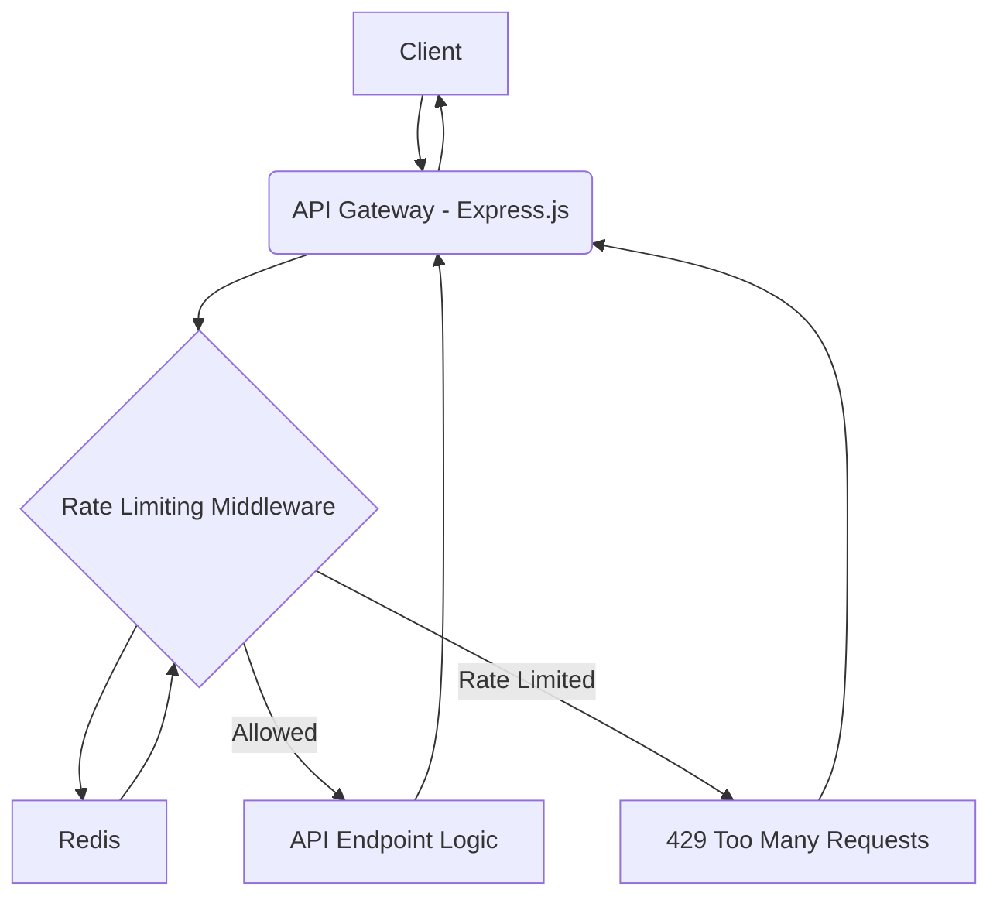
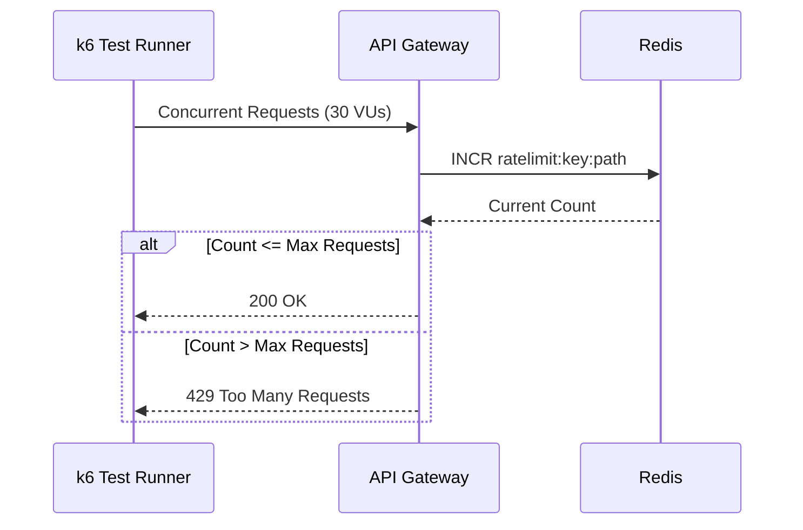
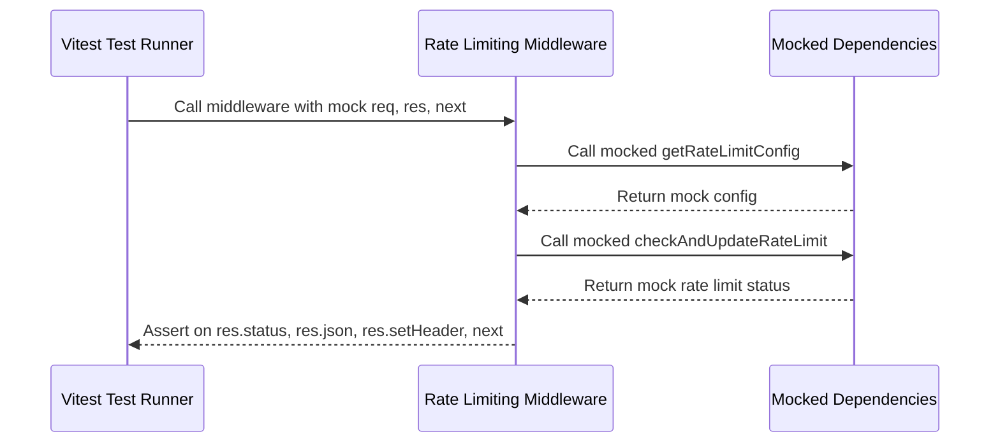

# System Patterns: Rate-Limited API Gateway

## Architecture

Express.js application with Redis for rate limiting state.

## Key Decisions

1. Fixed window algorithm (INCR + EXPIRE/TTL) for simplicity and performance
2. Redis for performance and atomic operations, leveraging Lua scripting for true atomicity
3. Lua scripting for atomicity
4. API key-based and per-endpoint limiting

## Component Relationships

- Express: Request flow orchestration
- Middleware: Rate limiting logic
- Redis: State management
- PostgreSQL: Persistent configuration storage
- k6: Ratelimiting tests
- Vitest: Unit testing

## Critical Paths

1. Atomic Redis operations
2. Configuration loading
3. Header management

## Concurrent Testing Pattern

We use k6 for concurrent request testing to validate the rate limiter:

Key characteristics:

- Simulates 30 concurrent users hitting the API simultaneously
- Validates exactly 10 successful requests per window
- Ensures Redis counters increment atomically without race conditions

## Unit Testing Pattern

We use Vitest for unit testing individual components and middleware:

Key characteristics:

- Isolates the middleware logic from external dependencies.
- Uses `vi.mock` to control the behavior of `getRateLimitConfig` and `checkAndUpdateRateLimit`.
- Asserts on Express `res` object methods (`status`, `json`, `setHeader`) and `next` function calls.
