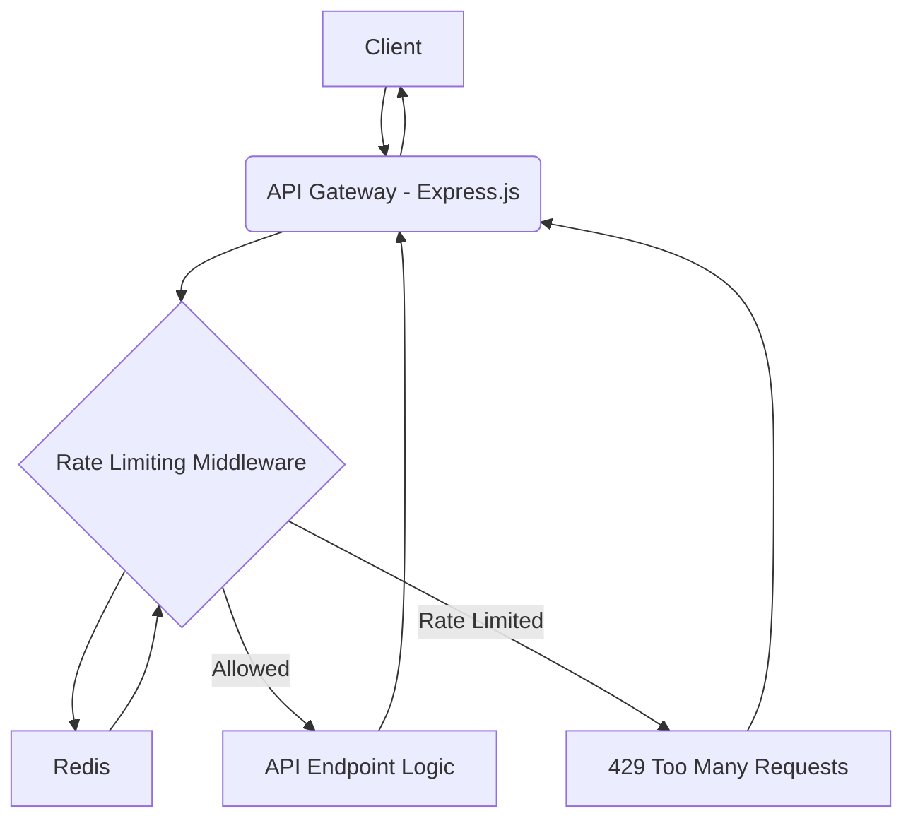

# System Patterns: Rate-Limited API Gateway

## Architecture

Express.js application with Redis for rate limiting state.

## Key Decisions

1. Sliding window algorithm for accuracy
2. Redis for performance and atomic operations
3. Lua scripting for atomicity
4. API key-based and per-endpoint limiting

## Component Relationships

- Express: Request flow orchestration
- Middleware: Rate limiting logic
- Redis: State management
- PostgreSQL: Persistent configuration storage

## Critical Paths

1. Atomic Redis operations
2. Configuration loading
3. Header management
