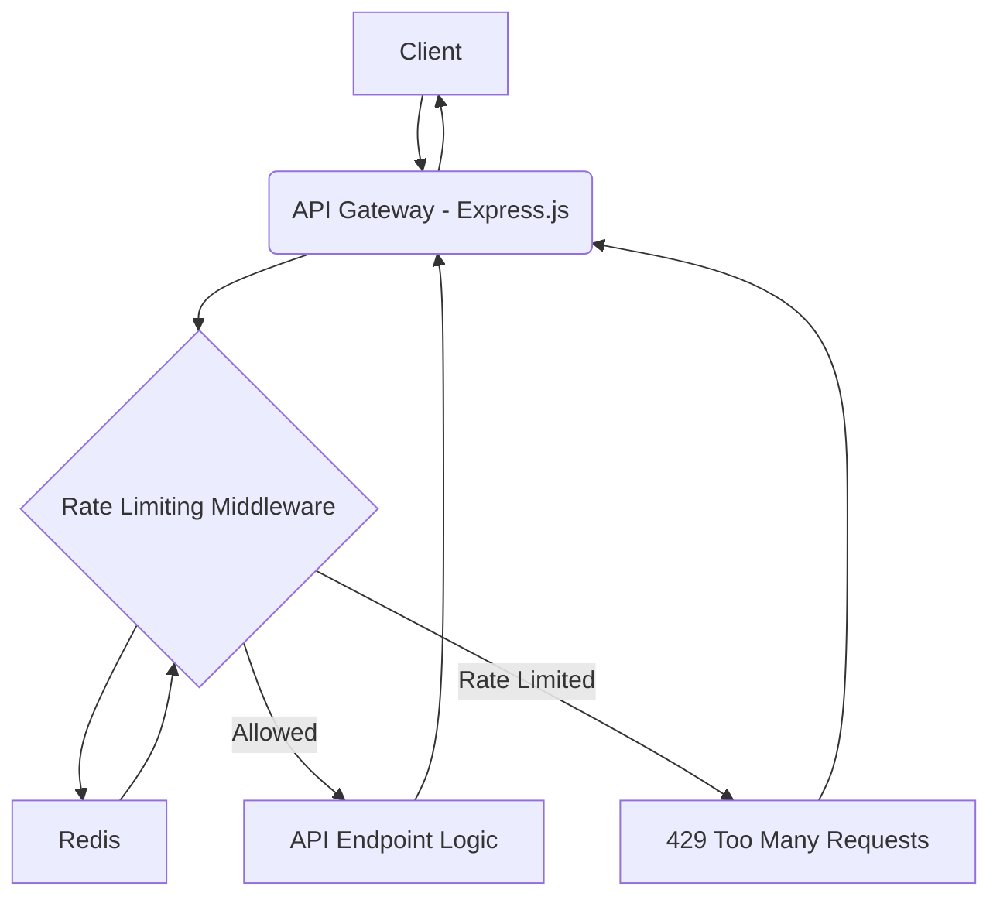

# System Patterns: Rate-Limited API Gateway

## System Architecture

The rate-limited API gateway will be built as an Express.js application, leveraging middleware for request processing. Redis will serve as the external, high-performance data store for managing rate limiting state.

## Key Technical Decisions

1.  **Sliding Window Algorithm**: Chosen for its accuracy in reflecting real-time usage compared to fixed windows, and better resource utilization than token bucket for bursty traffic.
2.  **Redis for State Management**: Selected for its speed, in-memory data structures, and native support for atomic operations (Lua scripting).
3.  **Redis Lua Scripting (`EVAL`)**: Essential for ensuring atomicity in read-then-write operations to prevent race conditions in a concurrent environment. This is critical for accurate rate limiting.
4.  **Express.js Middleware**: Provides a clean and standard way to intercept requests and apply rate limiting logic before they reach the main API handlers.
5.  **API Key Based Limiting**: Allows for granular control and differentiation of rate limits per consumer.
6.  **Per-Endpoint Configuration**: Enables flexible rate limit policies based on the sensitivity or resource intensity of specific API endpoints.

## Configuration Management

- **Environment Variables**: Configuration is loaded from `.env` files (e.g., `.env.development`, `.env.production`) using Node.js's native `--env-file` flag. This provides environment-specific settings for sensitive data like database connection strings.
- **Zod Validation**: Environment variables are validated at application startup using Zod to ensure all required configurations are present and correctly formatted, preventing runtime errors due to missing or malformed settings.

## Design Patterns in Use

- **Middleware Pattern**: Express.js inherently uses this pattern for request processing, allowing the rate limiter to be plugged in seamlessly.
- **Strategy Pattern (Implicit)**: Different rate limiting algorithms (though only sliding window is implemented here) could be seen as strategies. The current implementation focuses on one specific strategy.
- **Circuit Breaker (Future Consideration)**: While not directly part of the rate limiter, a circuit breaker pattern could complement it by preventing repeated calls to an already overloaded service.

## Component Relationships

- **Express Application**: Orchestrates the request flow and integrates the middleware.
- **Rate Limiting Middleware**: The core logic component, responsible for applying rate limiting rules.
- **Redis Client**: Communicates with the Redis server to store and retrieve rate limiting data.
- **PostgreSQL Client Pool**: Manages connections to the PostgreSQL database for storing and retrieving rate limit configurations and other persistent data.
- **Configuration Module**: Loads and validates environment-specific settings, providing a centralized source of truth for application configuration.

## Critical Implementation Paths

1.  **Atomic Redis Operations**: The implementation of the Lua script for atomically checking and incrementing request counts within the sliding window is the most critical part to ensure correctness under concurrency.
2.  **`Retry-After` Header Calculation**: Accurate calculation of the `Retry-After` value is crucial for client-side handling of rate limits.
3.  **API Key Extraction**: Secure and reliable extraction of the API key from incoming requests.
